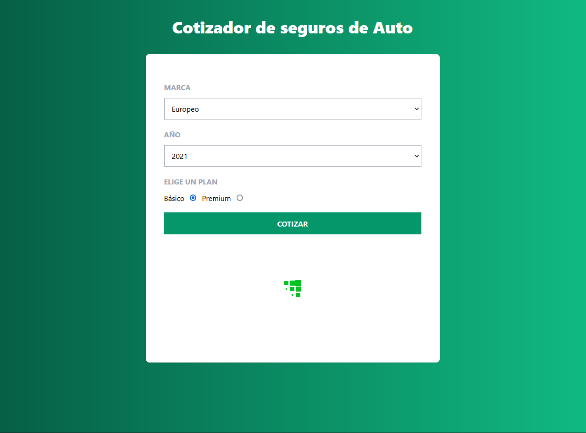
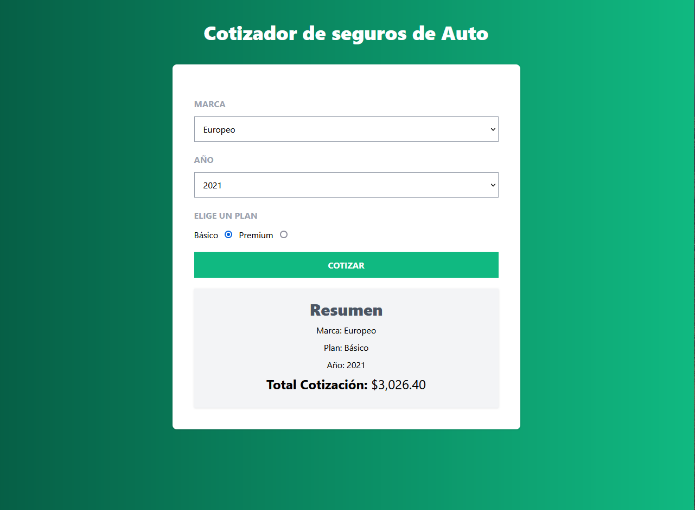
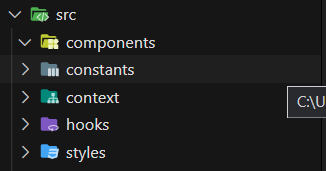
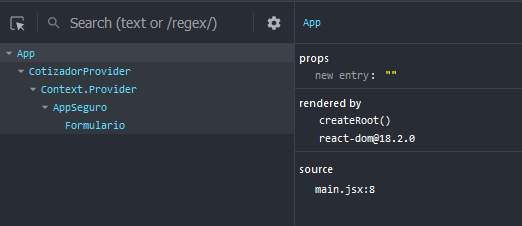

1. SET UP tailwind
2. [tailwind css](https://github.com/Leo-Zubiri/React-TailwindCSS#readme)
   
```npm i tailwindcss postcss autoprefixer```
```npx tailwindcss init -p```

  content: ['index.html','./src/**/*.jsx'],


# Estructura del proyecto


# Date.getFullYear
Retorna el año actual
```const YEARMAX = new Date().getFullYear();```

# Array.from
Hace un arreglo de 20 elementos
```export const YEARS = Array.from(new Array(20), (valor,index) => YEARMAX-index)```

# Context
Dentro del directorio context crear un CotizadorProvider.jsx:

---

# **Context API**

## 1. Crear context y provider

El provider es un componente que puede proporcionar funciones, variables y state a los componentes hijos. El context es lo que identifica a distintas porciones unas de otras.

```js

import {createContext,useState} from 'react'

const MiContext = createContext();

const MiProvider = ({children}) => {

  const numero = 10;
  const miFn = () => {}
  const [state,setState] = useState({datos:[],headers:{}});

  return (
        <CotizadorContext.Provider value={{
          numero,miFn,state,setState
        }}>
            {children}
        </CotizadorContext.Provider>
    )
}
```

## 2. Envolver a los componentes con el provider

Se importa el provider y entre estas etiquetas se colocan los componentes que tendrán acceso al contexto.

```js
import App	 from "./components/App"

import {MiProvider} from './context/MiProvider'

function App() {

  return (
    <MiProvider>
      <App  />
    </MiProvider>
  )
}

export default App
```



## 3. Importar el contexto
Desde los componentes envueltos por el provider para acceder al context.
Para usar determinado context se utiliza el hook ```useContext();```

```js
import MiContext from '../context/MiContext'

// Se obtienen las partes que se necesiten
const {numero,miFn,state,setState} = useContext(MiContext);
```

## 4. Simplificar lo anterior mediante Hook.

```js
import { useContext } from "react";

import MiContext from "../context/MiProvider";

const useMiContext = () => {
    return useContext(MiContext);
}

export default useMiContext;
```

Ahora para acceder a las porciones del contexto desde los componentes:

```JS
import useMiContext from '../hooks/useCotizador'

...

const {numero,miFn,state,setState} = useMiContext();
```

---

```js

let datos = {
  nombre: '',
  apellido: 'Zubiri'
}
Object.values(datos).includes('') // Retorna true si algun valor coincide dentro del objeto
```

---

## Decimales a mostrar **toFixed**
Dos decimales: 
 ```miVar.toFixed(2)```

## Formato de dinero
```js
export function formatearDinero(cantidad){
    return cantidad.toLocaleString('en-US',{
        style:'currency',
        currency:'USD'
    })
}
```
---

**Para evitar el re-render de los componentes cuando no es necesario:**

## useCallback, useMemo y useRef
```js 
import { useCallback,useMemo,useRef } from 'react';

...

// Solo alterará el resultado si una porcion del estado específico cambia
const [resultado] = useCallback(funcion,[stateEspecifico])

// Referencia directa a un componente en el DOM. useRef() is basically useState({current: initialValue })[0]
// Para guardar un valor de referencia:
const varRef = useRef(var);
console.log(varRef.current);

// Solo alterará el resultado si una porcion del estado específico cambia
const [resultado] = useMemo(()=>{},[stateEspecifico])
```

>The useMemo and useCallback Hooks are similar. The main difference is that useMemo returns a memoized value and useCallback returns a memoized function.
